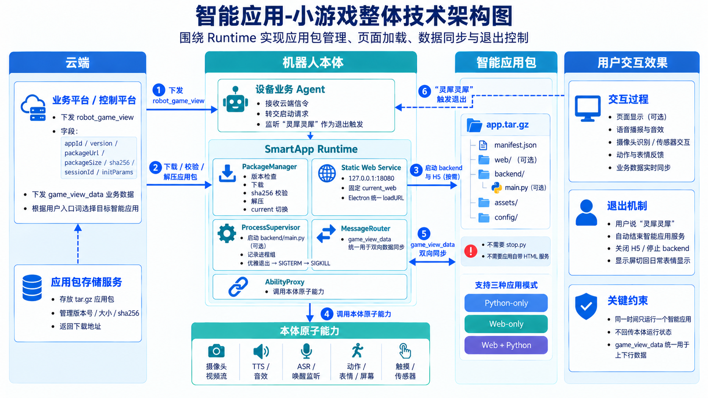
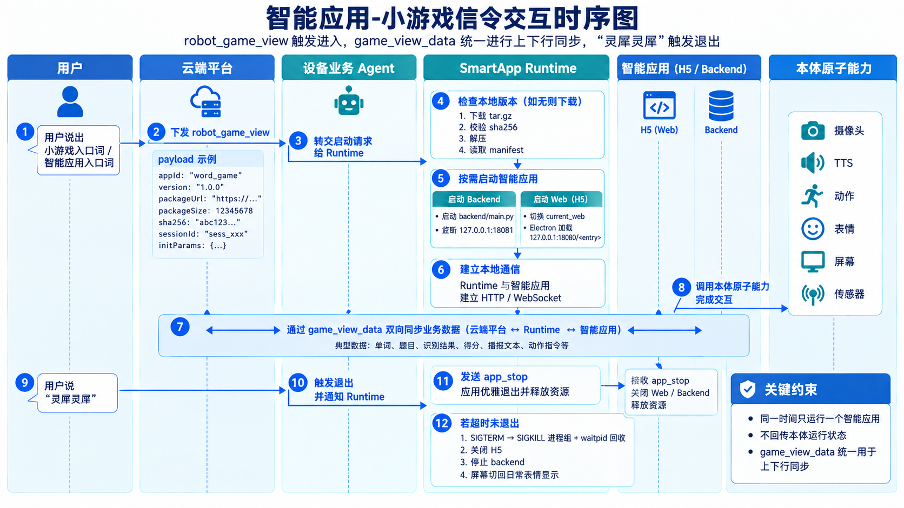
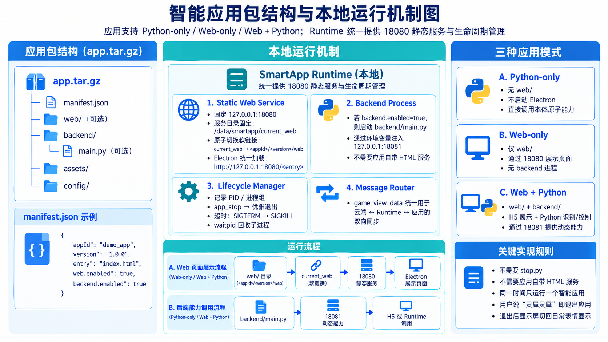

# 智能应用-小游戏整体技术方案设计

*最终版（围绕 SmartApp Runtime 的智能应用通用运行方案）*

## 1. 总体技术架构

整体方案由云端应用包存储与业务控制平台、设备业务 Agent、SmartApp Runtime、智能应用包以及本体原子能力组成。云端负责根据入口词选择目标智能应用并下发 robot_game_view；本体侧仅固化一套 SmartApp Runtime，负责应用包管理、页面加载、数据同步和退出控制。



图1  智能应用-小游戏整体技术架构图

| **模块** | **职责** |
| --- | --- |
| 云端应用包存储服务 | 存放 tar.gz 应用包，维护 appId、version、packageSize、sha256 和下载地址。 |
| 业务平台 / 控制平台 | 识别小游戏入口词；下发 robot_game_view；运行期间统一通过 game_view_data 与本体同步业务数据。 |
| 设备业务 Agent | 保持现有信令长连接；接收云端信令并转发给 Runtime；监听系统唤醒词“灵犀灵犀”并触发退出。 |
| SmartApp Runtime | 完成下载校验、解压、current 切换、backend 进程管理、18080 静态服务、18081 动态服务接入、消息路由与退出回收。 |
| 智能应用包 | 支持 Python-only、Web-only、Web+Python 三种模式；应用新增与升级只发应用包，不依赖本体固件更新。 |
| 本体原子能力 | 沿用现有 ROS2/SDK 能力，包括摄像头、TTS/音效、ASR/唤醒监听、动作/表情/屏幕、触摸/传感器等。 |

- 同一时间只运行一个智能应用。

- 不回传本体运行状态信令；与云端的业务数据同步统一使用 game_view_data。

- robot_game_view 一旦下发，即意味着开始进入对应智能应用；不再设计独立的 start / prepare / stop 云端信令。

## 2. 信令交互与运行时序



图2  智能应用-小游戏信令交互时序图

运行时序的核心逻辑如下：

| **阶段** | **关键动作** |
| --- | --- |
| 进入 | 用户说出入口词后，云端识别目标智能应用，播报欢迎语，同时下发 robot_game_view。设备业务 Agent 收到后立即转交 Runtime。 |
| 下载与启动 | Runtime 判断本地版本是否存在；如不存在则根据 packageUrl/packageSize/sha256 下载并校验，解压后读取 manifest，按需启动 backend，并按需加载 H5 页面。 |
| 交互中 | 业务数据上行和下行统一使用 game_view_data。Runtime 只做路由，不理解具体业务字段，如单词、题目、识别结果、分数、播报文本、动作指令等。 |
| 退出 | 当用户说出系统唤醒词“灵犀灵犀”时，设备业务 Agent 通知 Runtime；Runtime 向当前应用发 app_stop（本地内部事件）并执行资源回收，屏幕恢复日常表情。 |

其中，app_stop 是 Runtime 发给本地应用的内部退出通知，用于优雅收尾；它不是云端信令。

## 3. 云端与本体信令设计

### 3.1 进入智能应用：robot_game_view

robot_game_view 由云端下发，表示“进入指定智能应用”。本体收到后立即进入版本检查、必要的下载安装和应用拉起流程。

进入游戏

```text
{
  "deviceId": "11200",
  "domain": "DEVICE_ABILITY",
  "event": "robot_game_view",
  "eventId": "evt-001",
  "seq": 1789440000000,
  "response": false,
  "body": { "game": "start",
    "appid": "llm_app_xxxxx",
    "version": "1.2.0",
    "sessionId": "abc123",
    "packageUrl": "https://cdn.xxx.com/apps/rock_paper_scissors-1.2.0.tar.gz",
    "packageSize": 12345678,
    "md5": "abc123...",
    "data": {
      "mode": "normal"
    }
  }
}
```

| **字段** | **说明** |
| --- | --- |
| appid/ version | 确定本次要进入的目标智能应用及版本。appid为cmccAppId |
| sessionId | 标识本次应用会话；后续所有 game_view_data 必须带同一 sessionId。 |
| packageUrl / packageSize / md5 | 用于首次下载、大小初检与完整性校验。 |
| data | 应用首次运行参数，由 Runtime 原样转给 backend 或 H5。 |

退出游戏

```text
{
  "deviceId": "11200",
  "domain": "DEVICE_ABILITY",
  "event": "robot_game_view",
  "eventId": "evt-001",
  "seq": 1789440000000,
  "response": false,
  "body": { "game": "stop",
    "sessionId": "abc123"}
}
```

### 3.2 业务数据同步：game_view_data

智能应用运行期间，不再区分 game_view_event 等其它业务事件，统一使用 game_view_data 完成上行和下行数据同步。

云端 → 本体：

```text
{
  "deviceId": "11200",
  "domain": "DEVICE_ABILITY",
  "event": "game_view_data",
  "eventId": "evt-data-15",
  "seq": 1789440050000,
  "body": {
    "sessionId": "abc123",
    "data": {
      "word": "Apple",
      "meaning": "苹果"
    }
  }
}
```

本体 → 云端：

```text
{
  "deviceId": "11200",
  "domain": "DEVICE_ABILITY",
  "event": "game_view_data",
  "eventId": "robot-data-21",
  "seq": 1789440055000,
  "body": {
    "sessionId": "abc123",
    "data": {
      "user": "rock",
      "robot": "scissors",
      "result": "win"
    }
  }
}
```

| **字段** | **规则** |
| --- | --- |
| sessionId | 必须与当前应用会话一致，旧会话数据直接丢弃。 |
| seq | 在当前 session 内递增，用于去重和乱序保护。 |
| target | 下行可选：auto / python / web / broadcast；auto 按 manifest 规则分发。 |
| type | 上行可选，用于区分 game_result / interaction / task_result / ability_result 等。 |
| data | 应用自定义 JSON，Runtime 不关心业务字段含义。 |
| trigger | 兼容现有设计，可用于关联当前轮次或云端待播报文本。 |

如果云端当前中间输出仍包含 prechat / biz_params / scripts，可按以下方式兼容：prechat 继续进入 TTS 链路；biz_params 继续维护会话参数；scripts 映射为 game_view_data.body.data。

## 4. 应用包结构与本地运行机制



图3  智能应用包结构与本地运行机制图

应用包支持 Python-only、Web-only、Web+Python 三种模式。Runtime 统一提供 18080 静态服务与生命周期管理。

```text
<appId>-<version>.tar.gz
└── <appId>/
    ├── manifest.json          # 必须
    ├── web/                     # 可选
    │   └── index.html ...    # 网页入口固定为index.html
    ├── backend/              # 可选
    │   └── main.py ...       # python脚本入口固定为main.py        │   └── vendor/...        # 可选：随包依赖
        ├── assets/                 # 可选
        └── config/                 # 可选{
  "appId": "demo_app",
  "version": "1.0.0",
  "entry": "index.html",
  "web.enabled": true,
  "backend.enabled": true
}
```

- 不需要 stop.py。生命周期完全由 Runtime 管理：优雅退出 → SIGTERM → SIGKILL 进程组 + waitpid 兜底。

- 不需要应用自带静态 HTML 服务。Runtime 常驻 127.0.0.1:18080，统一加载当前版本 web/。

- 如需动态 HTTP/WebSocket/视频流能力，由 backend 按需监听 127.0.0.1:18081；Runtime 通过环境变量注入端口。

### 4.1 Runtime 18080 静态服务

18080 服务启动后常驻，服务根目录固定为 /data/smartapp/current_web。启动 Web 类应用时，Runtime 只需原子切换 current_web 软链接指向当前版本的 web/，静态服务本身不需要重启。

```text
/data/smartapp/current_web
    -> /data/smartapp/apps/rock_paper_scissors/1.2.0/web

# 原子切换思路
1. 创建 current_web.tmp -> <目标版本>/web
2. os.replace(current_web.tmp, current_web)
3. Electron loadURL("http://127.0.0.1:18080/<entry>?v=<version>")
```

### 4.2 Runtime 与应用本地通信

Runtime 与 backend 推荐采用 stdin/stdout JSON Lines 或本地 IPC 交互；H5 则通过统一 JS Bridge 与 Runtime 通信。

```text
# Runtime -> backend
{"type":"runtime_init","sessionId":"abc123","data":{"mode":"normal"}}
{"type":"cloud_data","seq":15,"data":{"word":"Apple"}}

# backend -> Runtime
{"type":"app_data","type2":"game_result","data":{"result":"win"}}
```

```javascript
// Runtime -> H5
window.smartApp.onMessage((message) => {
  // message.data 为业务数据
});

// H5 -> Runtime
window.smartApp.postMessage({
  type: "game_result",
  data: { result: "win" }
});
```

## 5. 本体原子能力与显示链路

需要调用机器人本体能力的智能应用，由 backend/main.py 直接按现有附件里的原子能力使用方式接入，不在一期额外重新封装一层大而全的能力框架。

| **能力类型** | **使用方式 / 典型场景** |
| --- | --- |
| 摄像头 / 视频流 | 用于手势识别、目标识别等视觉类智能应用。 |
| TTS / 音效 | 用于欢迎语、规则说明、结果播报、跟读反馈。 |
| ASR / 唤醒监听 | 用于监测系统唤醒词“灵犀灵犀”，触发退出智能应用。 |
| 动作 / 表情 / 屏幕 | 用于胜负动作、互动表情、页面展示与退出后回到日常表情。 |
| 触摸 / 传感器 | 用于摸头触发、传感器交互等。 |

Web / Hybrid 一期继续沿用当前显示链路：web/index.html → Electron Offscreen → FFmpeg 旋转 → FIFO → MPV DRM/KMS → 480×800 实体屏。Python-only 应用不启动该链路。

## 6. 时延优化、异常处理与落地建议

| **场景** | **处理方案** |
| --- | --- |
| 首次进入 | 欢迎语播放与 robot_game_view 下发并行，本体在欢迎语期间完成下载、解压和页面/进程启动。 |
| 二次进入 | 本地已有目标版本时不再下载，直接读取 manifest 并拉起应用。 |
| 下载异常 | 下载到 .part；若 packageSize 不一致或 sha256 校验失败，直接删除临时包并终止本次安装。 |
| 新版本运行异常 | current 保持不变或回滚 previous；清理后台进程和页面后恢复日常表情。 |
| backend 异常退出 | Runtime 清理进程组和 Web 页面，记录日志，恢复默认显示。 |
| 唤醒词退出 | 停止数据投递 → app_stop → SIGTERM → 超时 SIGKILL + waitpid → 关闭 H5 / 停止 backend → 屏幕恢复日常表情。 |

- 下载使用 HTTPS，packageUrl 建议采用短时效签名 URL。

- 解压需防止路径穿越、软链接越界等安全问题。

- Runtime 只允许执行 manifest 中声明的 backend 入口，不执行云端直接下发的任意脚本。

- 应用新增或升级只发布新应用包和云端元数据，本体固件原则上不再跟随每个应用迭代。

## 7. 一期开发项

| **本体侧** | **云端侧** |
| --- | --- |
| 新增 SmartApp Runtime：Package Manager、Process Supervisor、Message Router、18080 静态服务、Renderer Controller。 | 建设应用包存储能力，管理 tar.gz 包、版本、大小、sha256 和下载地址。 |
| 设备业务 Agent 接入 robot_game_view 与 game_view_data，并监听系统唤醒词事件转给 Runtime。 | 入口词命中后创建 session、播欢迎语并下发 robot_game_view。 |
| 实现 .part 下载、sha256 校验、解压、current/previous 版本切换。 | 运行期间统一通过 game_view_data 与本体同步上下行业务数据。 |
| 实现 Python 进程组拉起、优雅退出和显示恢复。 | 应用新增/升级只需上传新包与元数据，不要求本体固件更新。 |

**验收标准：三种应用模式均可独立接入；缓存版本不重复下载；sha256 错误时拒绝安装；game_view_data 可双向同步；用户说“灵犀灵犀”后应用退出且无残留进程，显示屏恢复日常表情。**
